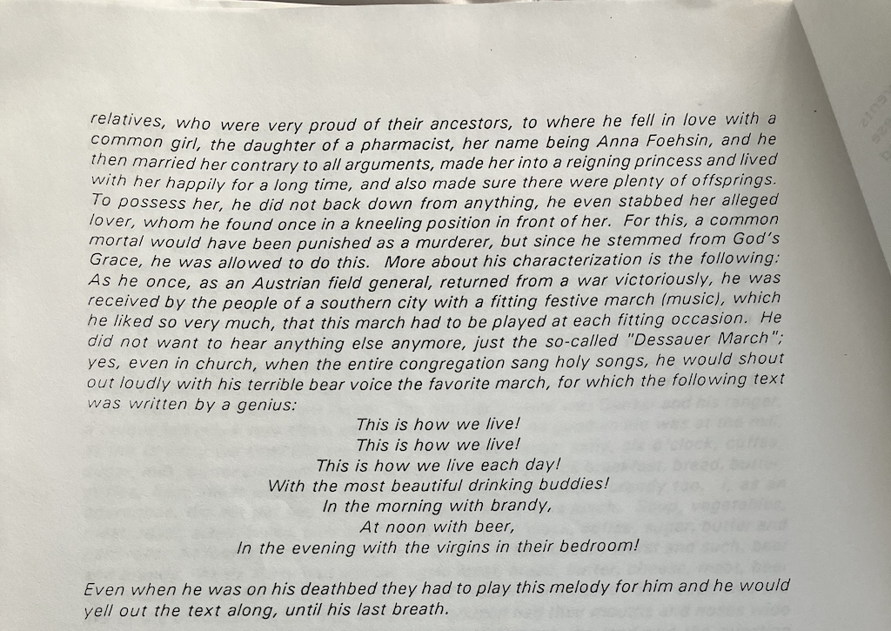

# Digitizing Historical Documents: OCR with PyTesseract and AI Correction

## Overview

This project demonstrates a complete pipeline for digitizing historical documents using traditional OCR combined with modern AI correction. The approach uses [PyTesseract](https://github.com/h/pytesseract), [OpenCV](https://opencv.org/), and OpenAI's GPT-5 model to convert scanned pages into accurate, searchable text.

**What makes this project unique:**

- **Real-world example** - Digitizes 30 pages of my great-great-grandfather's autobiography
- **Complete pipeline** - From raw scans to formatted markdown/PDF output
- **AI-powered correction** - Uses GPT-5 to fix OCR errors while preserving original meaning
- **Benchmarked results** - Measured accuracy improvements with preprocessing and correction
- **Production-ready** - Batch processing, interactive viewer, and comprehensive documentation

The project includes:

- Image preprocessing pipeline optimized for aged documents
- Batch processing capabilities for multi-page documents
- Interactive [Streamlit](https://streamlit.io) viewer for result validation
- Benchmarking tools for measuring accuracy improvements
- Complete tutorial for building similar systems

## The August Anton Project

This OCR pipeline was developed to digitize a 30-page autobiography written by my paternal great-great-grandfather, August Anton, sometime before his death in 1911. The document chronicles his fascinating life, including participation in the 1848 German revolution, immigration to America, and establishing a successful carpentry business in Birmingham, Alabama.

The challenge: Convert 30 pages of photocopied, aged printed text into searchable, accurate digital form while preserving the original voice and content.

## License

This code, text, and other original work on my part in this repo is under the MIT license.

The original text by August Anton, described below, is to the best of my understanding in the public domain in the United States at this point since the author passed away in 1911.

## Example Screenshots

**Interactive Viewer:**


**Example Document Page:**



## Background on the Text

The text used in this project are photos of a brief autobiographical work by my paternal great great grandfather, August Anton.

He had quite an interesting life, including the 1848 revolution in Germany, being banned from Bremen for running a study group, immigrating to America, running a business in Birmingham where he eventually settled. He was a master carpenter, in the literal sense of having apprenticed, worked and traveled as a journeyman, and then passed a master examination.

The text was provided to me as thirty pages of photocopies by my uncle, James (Jim) Anton in 1999, a short while after my father passed away. I believe he provided the same text to a number of his other relatives as well.

According to [Ancestry.com](https://www.ancestry.com),

> August Fredrick Anton was born in 1830 in Zerbst, Saxony-Anhalt,  Germany, the son of Sophia and August. He married Sophia Bertha Tiebetz  in 1858 in Germany. They had six children in 13 years. He died on  January 2, 1911, in Birmingham, Alabama, having lived a long life of 81  years.

## Setup

### System Dependencies

The Python packages used in this project require Tesseract OCR and Poppler to be installed at the system level.

**macOS/Linux:**

```bash
brew install tesseract poppler
```

**Ubuntu/Debian:**

```bash
sudo apt-get install tesseract-ocr poppler-utils
```

**Windows:**

- Install Tesseract from [GitHub releases](https://github.com/UB-Mannheim/tesseract/wiki)
- Install Poppler from [poppler-windows](https://github.com/oschwartz10612/poppler-windows)
- Add both to system PATH

### Python Environment

Create a virtual environment and install dependencies:

```bash
# Create a Python virtual environment
python -m venv .venv
source .venv/bin/activate  # On Windows, use `.venv\Scripts\activate`

# Install Python dependencies
pip install -r requirements.txt
```

**Key dependencies:**

- `opencv-python` - Image preprocessing
- `pytesseract` - OCR engine wrapper
- `pillow` - Image handling
- `pandas` - Data management
- `streamlit` - Interactive viewer
- `openai` - GPT-5 correction
- `python-Levenshtein` - Accuracy metrics
- `python-dotenv` - Environment configuration

### API Configuration

Create a `.env` file with your OpenAI API key (required for LLM correction):

```bash
echo "OPENAI_API_KEY=your-key-here" > .env
```

## Usage

### Basic OCR Pipeline

Process scanned documents or PDFs:

```bash
python text_from_pdfs.py [--max N]
```

The script processes images listed in `input_file_list.txt` and performs:

1. Image preprocessing (grayscale → noise reduction → thresholding)
2. Region-based text extraction with PyTesseract
3. GPT-5 error correction
4. Output generation

Results are saved to:

- `output/results.csv` - Processing results with all stages
- `output/extracted.txt` - Raw OCR text
- `output/corrected.txt` - AI-corrected text
- `output/*_proc.jpg` - Preprocessed images for inspection

### Benchmarking

Measure accuracy and compare preprocessing approaches:

```bash
# Create ground truth template files
python benchmark.py --input images/ --create-template

# Edit ground_truth/*_ref.txt files with correct text for each image

# Run benchmark comparing different methods
python benchmark.py --input images/ \
  --methods pytesseract pytesseract_no_preprocess pytesseract_gpt5
```

**Supported methods:**

- `pytesseract` - Document OCR with preprocessing
- `pytesseract_no_preprocess` - Document OCR without preprocessing  
- `pytesseract_gpt5` - Document OCR with GPT-5 correction

**Ground Truth Format:**

Ground truth is stored in individual text files:

- Format: `ground_truth/{image_basename}_ref.txt`
- Example: `images/IMG_8479.jpg` → `ground_truth/IMG_8479_ref.txt`
- Files can contain comment lines starting with `#`

The benchmark measures:

- **Character Error Rate (CER)** - Percentage of characters incorrectly recognized
- **Word Error Rate (WER)** - Percentage of words with errors
- **Processing time** - Seconds per page

### Interactive Viewer

Launch the Streamlit app to view and validate results:

```bash
streamlit run viewer_app.py
```

The app allows you to:

- View original and preprocessed images side-by-side
- Compare raw OCR output with AI-corrected text
- Navigate through pages with buttons or slider
- Validate results before final export

### Markdown Formatting

Convert corrected text to structured Markdown:

```bash
# Format all pages
python make_md.py --file output/results.csv

# Format first N pages only
python make_md.py --file output/results.csv --max 10
```

Output saved to `output/pages.md`.

### PDF Generation

You can generate a LaTeX or PDF version of the formatted markdown:

```bash
# Generate LaTeX
pandoc -f markdown -t latex --wrap=preserve august_anton.md -o august_anton.tex

# Generate PDF
pandoc -f markdown -t pdf --wrap=preserve august_anton.md -o august_anton.pdf
```

The draft, combined version including some hand edits is in [august_anton.md](august_anton.md). A PDF version formatted in LaTeX using Overleaf is at [August_Anton___Reflections.pdf](August_Anton___Reflections.pdf).

## Code Architecture

### Pipeline Pattern

The OCR pipeline follows a multi-stage process:

1. **Image Preprocessing** → 2. **Text Extraction** → 3. **LLM Correction** → 4. **Output Generation**

This separation allows easy comparison between methods and optional correction.

### Key Scripts

- **`text_from_pdfs.py`**: Main OCR pipeline for document digitization
  - Image preprocessing (grayscale, noise reduction, thresholding)
  - Region-based text extraction using morphological operations
  - Sorts regions by Y-coordinate (then X) to preserve reading order
  - GPT-5 correction for OCR errors
  - Outputs CSV, text files, and preprocessed images

- **`benchmark.py`**: OCR method comparison and accuracy measurement
  - Calculates CER (Character Error Rate) and WER (Word Error Rate)
  - Loads ground truth from `ground_truth/*_ref.txt` files
  - Generates CSV results and markdown reports
  - Supports multiple OCR methods for comparison

- **`viewer_app.py`**: Interactive Streamlit app for result viewing
  - Side-by-side image comparison (original vs preprocessed)
  - Text comparison (extracted vs corrected)
  - Page navigation and statistics

- **`make_md.py`**: Post-processing formatter
  - Converts corrected text to structured Markdown
  - Uses GPT-5 to add formatting while preserving content
  - Outputs publication-ready markdown files

- **`common.py`**: Shared utilities
  - File path helpers for preprocessed images

### Image Processing

**Document OCR preprocessing** (for typed/printed text):

- Aggressive preprocessing: grayscale → median blur → binary threshold
- Region-based extraction using morphological dilation to find text blocks
- Morphological kernel: 50×40 rectangle for document region detection

### Output Directory

All outputs go to `output/` directory (created automatically):

- Preprocessed images: `output/{basename}_proc.jpg`
- Results CSV: `output/results.csv`
- Extracted text: `output/extracted.txt`
- Corrected text: `output/corrected.txt`

## Common Pitfalls

1. **Missing system dependencies**: pytesseract requires tesseract and poppler to be installed at system level
2. **Ground truth format**: Benchmark uses individual `*_ref.txt` files in `ground_truth/` directory, not a central JSON
3. **GPT-5 prompt sensitivity**: Vague prompts can make results worse. Use the specific prompt from `text_from_pdfs.py`
4. **PDF2Image dependency**: Requires poppler for PDF processing

## Important Configuration

- **OpenAI Model**: Uses `gpt-5` model (defined in `text_from_pdfs.py` and `make_md.py`)
- **Input file list**: `text_from_pdfs.py` reads image paths from `input_file_list.txt`
- **Morphological kernel**: 50×40 rectangle for region detection (defined as `RECT_SIZE`)
- **Minimum bounding box**: 30×30 pixels to filter noise (defined as `MIN_BBOX_WIDTH/HEIGHT`)
- **Median blur kernel**: Size 5 for noise reduction
- **Tesseract PSM modes**: PSM 6 (block) for normal regions, PSM 8 (word) for small regions

## Academic Citations

This project builds on important research works and open-source tools:

### Tesseract OCR

Smith, R. (2007). **An Overview of the Tesseract OCR Engine**. In *Proceedings of the Ninth International Conference on Document Analysis and Recognition (ICDAR '07)*, pp. 629-633. IEEE Computer Society.

> Tesseract is the foundational open-source OCR engine used for document text extraction in this project. Originally developed by HP in the 1980s, it was open-sourced by Google and remains one of the most accurate OCR engines for printed text.

### GPT-5

OpenAI. (2025). **GPT-5 System Card**. <https://openai.com/index/gpt-5-system-card/>

> GPT-5 is used in this project for intelligent OCR error correction, leveraging its language understanding to fix common OCR mistakes while preserving the original meaning and style.

### BibTeX Entries

```bibtex
@inproceedings{smith2007tesseract,
  author = {Ray Smith},
  title = {An Overview of the Tesseract OCR Engine},
  booktitle = {ICDAR '07: Proceedings of the Ninth International Conference on Document Analysis and Recognition},
  year = {2007},
  pages = {629--633},
  publisher = {IEEE Computer Society}
}

@manual{openai2025gpt5,
  title        = {GPT-5 System Card},
  author       = {OpenAI},
  year         = {2025},
  note         = {\url{https://cdn.openai.com/gpt-5-system-card.pdf}},
  howpublished = {\url{https://cdn.openai.com/gpt-5-system-card.pdf}},
  organization = {OpenAI}
}
```

### Key Libraries and Tools

- **Tesseract OCR** - Open-source OCR engine: [https://github.com/tesseract-ocr/tesseract](https://github.com/tesseract-ocr/tesseract)
- **PyTesseract** - Python wrapper for Tesseract: [https://github.com/h/pytesseract](https://github.com/h/pytesseract)
- **OpenCV** - Computer vision and image preprocessing: [https://opencv.org/](https://opencv.org/)
- **Pillow (PIL)** - Python image processing: [https://python-pillow.org/](https://python-pillow.org/)
- **Streamlit** - Interactive web applications: [https://streamlit.io](https://streamlit.io)
- **OpenAI API** - GPT-5 for error correction: [https://platform.openai.com/docs](https://platform.openai.com/docs)

## Credits

I took inspiration and some code snippets from various articles online:

This article has a good overview of image preprocessing methods for OCR.

- <https://towardsdatascience.com/pre-processing-in-ocr-fc231c6035a7>

The article provided a great example of identifying rectangles in the image to process separately.

- <https://medium.com/@siromermer/extracting-text-from-images-ocr-using-opencv-pytesseract-aa5e2f7ad513>

## Known Limitations

- **Layout complexity**: Region-based extraction works well for simple layouts but may struggle with complex multi-column documents or tables
- **Handwriting**: This system is optimized for typed/printed text. Handwritten documents require different OCR approaches
- **Language**: Currently configured for English. Multi-language support requires additional Tesseract language packs
- **GPT-5 prompt sensitivity**: Results are highly dependent on prompt wording. Use the tested prompts in the code.

## Troubleshooting

### "Tesseract not found"

```bash
# Verify Tesseract is installed
tesseract --version

# If not found, install or add to PATH
```

### "OpenAI API error"

```bash
# Verify API key is set
python -c "import os; from dotenv import load_dotenv; load_dotenv(); print('API key loaded' if os.getenv('OPENAI_API_KEY') else 'No API key')"

# Check your OpenAI account has credits at https://platform.openai.com/account/billing
```

### "No module named 'cv2'"

```bash
# Ensure opencv-python is installed
pip install opencv-python
```

### Poor OCR results

- Check preprocessed images in `output/*_proc.jpg` to verify preprocessing improved quality
- Try adjusting median blur kernel size (currently 5) in `text_from_pdfs.py`
- Verify input images are high enough resolution (at least 300 DPI recommended)

## Future Improvements

- Enhanced Streamlit viewer with better navigation controls
- Page dewarping for curved book pages (see [page_dewarp](https://github.com/tachylatus/page_dewarp))
- Vision-based correction using GPT-4o with image input for better context
- Parallel processing for large document batches
- Confidence scoring to identify pages needing manual review

---

If you enjoyed content like this, I write The Cognitive Engineering Newsletter — short essays on attention, learning systems, and AI agents.
👉 <https://ranton.org/newsletter>
