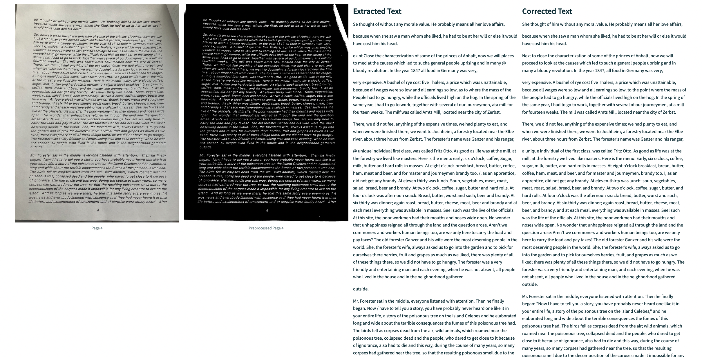

# Python OCR using Pytesseract, Pillow, and openCV

## Overview

This project shows how to extract text from images or PDFs using [PyTesseract](https://github.com/h/pytesseract), [Pillow](https://python-pillow.org/), and [opencv-python](https://github.com/opencv/opencv-python).

It performs a number of preprocessing steps to improve the results.

It augments the OCR by asking OpenAI's [GPT-4o](https://openai.com/index/hello-gpt-4o/) to correct the OCR output.

There is a hand edited final document included as well with markdown formatting I used ChatGPT to help generate as well, though by hand in this case.

The process is visualized with a [Streamlit](https://streamlit.io) app that shows the original image, preprocessed image, exctracted text, and corrected text for each page.

The input images as well as the code and results are included in the repository.

Note that I have code for handling input PDFs, for completeness of the example, but all of my input files are JPEG format.

This code, text, and other original work on my part in this repo is under the MIT license.

The original text by August Anton, described below, is to the best of my understanding in the public domain in the United States at this point since the author passed away in 1911.

## Example Screenshot of the App




## Background on the Text

The text used in this project are photos of a brief autobiographical work by my paternal great great grandfather, August Anton. 

He had quite an interesting life, including the 1848 revolution in Germany, being banned from Bremen for running a study group, immigrating to America, running a business in Birmingham where he evenutally settled. He was a master carpenter, in the literal sense of having apprenticed, worked and traveled as a journeyman, and then passed a master examination.

The text was provided to me as thirty pages of photocopies by my uncle, James (Jim) Anton in 1999, a short while after my father passed away.  I believe he provided the same text to a number of his other relatives as well.

According to [Ancestry.com](https://www.ancestry.com), 

> August Fredrick Anton was born in 1830 in Zerbst, Saxony-Anhalt,  Germany, the son of Sophia and August. He married Sophia Bertha Tiebetz  in 1858 in Germany. They had six children in 13 years. He died on  January 2, 1911, in Birmingham, Alabama, having lived a long life of 81  years.

## Setup

The python packages used in this project require the tesseract and poppler libraries.

You can install them with Homebrew on MacOS or Linux. See the tesseract or poppler documentation for instructions for other platforms.

```bash
brew install tesseract
brew install poppler
```

Setup the conda environment and install python dependencies.
```bash
conda env create -p ./env  -f local_environment.yml
```

The Streamlit app uses requirements.txt and Pip rather than conda because it has fewer dependencies, and it boots faster on Streamlit Community Cloud this way.

The draft, combined version including some hand edits is in [august_anton.md](august_anton.md).

You can generate a LaTex or PDF version of the combined, corrected pages like this.

```bash
# generate Latex 
pandoc -f markdown -t latex --wrap=preserve  august_anton.md -o august_anton.tex

# Generate DPF
pandoc -f markdown -t pdf --wrap=preserve  august_anton.md -o august_anton.pdf
```

A PDF version formatted in LaTex using overleaf to adjust the one generated by pandoc is at [August_Anton___Reflections.pdf](August_Anton___Reflections.pdf).

## Credits

I took inspiration and some code snippets from various articles online:

This article has a good overview of image preprocessing methods for OCR.

- <https://towardsdatascience.com/pre-processing-in-ocr-fc231c6035a7>

The article provided a great example of identifying rectangles in the image to process separately.

- <https://medium.com/@siromermer/extracting-text-from-images-ocr-using-opencv-pytesseract-aa5e2f7ad513>

## Future Improvements

- Change the Streamlit viewer app to use actual Streamlit pages and better controls for next and previous.

- Use the dewarping algorithm discussed in <https://mzucker.github.io/2016/08/15/page-dewarping.html> and implemented in <https://github.com/tachylatus/page_dewarp>.

- Use [GPT-4o vision support]( https://platform.openai.com/docs/guides/vision) to use the image as part of the input to the correction process for the extracted text.
